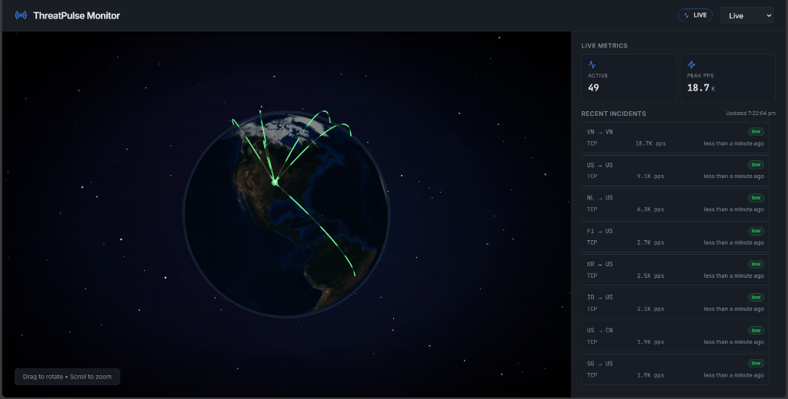
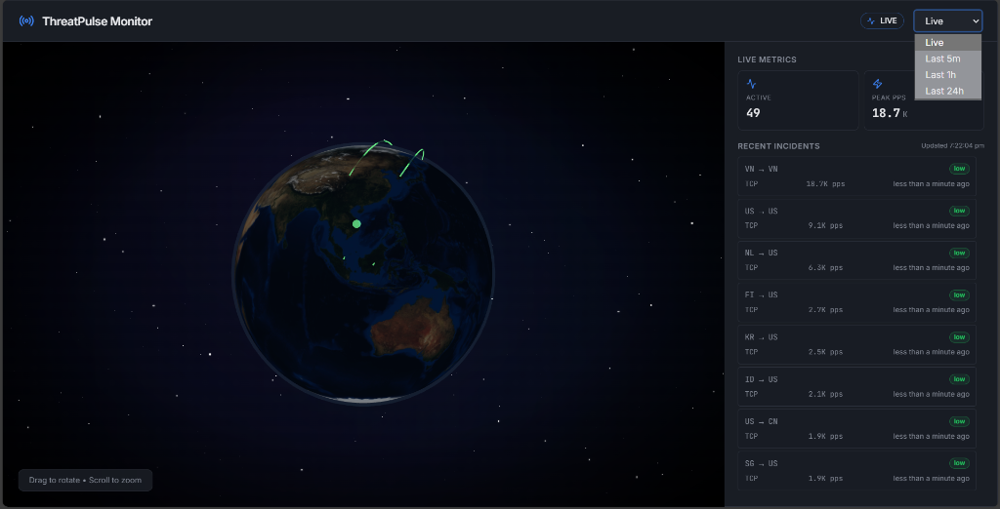

# 🌍 ThreatPulse Monitor

A real-time DDoS attack visualization platform featuring an interactive 3D globe, live threat metrics, and deep space aesthetics. Powered by Cloudflare Radar and AbuseIPDB data with machine learning threat classification.



---

##  Features

### 🎨 Visual Design
- **Immersive Space Background** - Multi-layered starfield with animated nebula effects
- **3D Interactive Globe** - Realistic Earth texture with smooth rotation and zoom controls
- **Animated Attack Arcs** - Flowing cyan/red arcs showing attack paths between countries
- **Pulsing Attack Indicators** - Glowing dots for same-location attacks
- **Premium UI** - Glassmorphic panels with depth and modern aesthetics

### 📊 Live Data & Metrics
- **Real-Time Attack Feed** - Live updates from Cloudflare Radar API
- **Live Threat Intelligence** - Fresh threat IPs from AbuseIPDB with real-time SHA-256 hashing
- **Dynamic Trend Indicators** - Live-calculated percentage changes for metrics
- **Time Range Filtering** - View attacks from last 5m, 1h, 24h, or live
- **Auto-Refresh** - Optional automatic data updates
- **Severity-Based Color Coding** - Green (low) / Amber (medium) / Red (high)

### 🔒 Security & Privacy
- **IP Anonymization** - All IPs hashed with SHA-256
- **ML Threat Scoring** - Machine learning model for threat classification
- **Country-Level Geolocation** - Privacy-preserving location data
- **No Raw IP Storage** - Full GDPR compliance

### 🛠️ Technical Stack
- **Frontend**: React + TypeScript + Vite
- **3D Rendering**: Three.js with React Three Fiber
- **Backend**: FastAPI (Python)
- **Styling**: TailwindCSS with custom gradients
- **Data Sources**: Cloudflare Radar + AbuseIPDB

---

## 🚀 Quick Start

### Prerequisites
- Node.js 18+ and npm
- Python 3.8+
- API keys (Cloudflare Radar)

### 1. Clone Repository
```bash
git clone https://github.com/Shaurya-34/ddos-attack-map.git
cd ddos-attack-map
```

### 2. Install Dependencies

**Backend:**
```bash
pip install -r backend/requirements.txt
```

**Frontend:**
```bash
cd frontend
npm install
cd ..
```

### 3. Configure Environment Variables

Create a `.env` file in the project root:

```env
CLOUDFLARE_API_TOKEN=your_cloudflare_token_here
ABUSEIPDB_API_KEY=your_abuseipdb_key_here
```

> **Note**: Both API keys are required for full functionality. The app will fallback to static data if AbuseIPDB API is unavailable.

### 4. Run the Application

**Start Backend:**
```bash
uvicorn backend.mains:app --reload
```

**Start Frontend** (in a new terminal):
```bash
cd frontend
npm run dev
```

**Access the App:**
- Frontend: `http://localhost:5173`
- Backend API: `http://127.0.0.1:8000/combined`

---

## 🔑 API Keys Setup

### Cloudflare Radar Token (Required)
1. Sign up at [Cloudflare](https://www.cloudflare.com/)
2. Navigate to [Cloudflare Radar API](https://developers.cloudflare.com/radar/)
3. Generate an API token with Radar read permissions
4. Add to `.env` as `CLOUDFLARE_API_TOKEN`

### AbuseIPDB API Key (Required for Live Data)
1. Register at [AbuseIPDB](https://www.abuseipdb.com/)
2. Verify email and navigate to API settings
3. Copy your API key
4. Add to `.env` as `ABUSEIPDB_API_KEY`

> **Note**: Live AbuseIPDB threat data is fetched and hashed in real-time for privacy. Falls back to static dataset if API is unavailable.

> **Security Note**: Never commit your `.env` file. It's automatically ignored by Git.

---

## 🟣 AbuseIPDB Features

- **Live Threat Intelligence** - Real-time threat IPs with SHA-256 hashing for privacy
- **Purple Pulsing Dots** - Distinct purple markers on globe for AbuseIPDB threats
- **Auto-Cycling Visualization** - Rotates through 50 threats every 13 seconds, displaying 10 at a time
- **24-Hour Caching** - Avoids rate limits while keeping data fresh
- **Mixed Incident Feed** - Shuffled display of Cloudflare attacks and AbuseIPDB threats
- **Privacy-Preserving** - Coordinate randomization (±50km) for enhanced anonymity

---

## 📸 Screenshots

### Main Globe View
Real-time attack visualization with deep space background and live metrics.


### Time Range Selector
Filter attacks by time period (Live, 5m, 1h, 24h).



---

## 🤖 Machine Learning Model

The project includes a pre-trained ML model for threat classification:

- **Model Files**: `backend/models/ip_classifier.joblib` and `country_encoder.joblib`
- **Training Data**: Anonymized, hashed IP datasets
- **Prediction**: Real-time DDoS likelihood scoring based on abuse confidence and country codes

> **Note**: AbuseIPDB provides general abuse reports, not direct DDoS indicators. The ML model analyzes patterns to predict DDoS-related threats.

**To Retrain** (optional):
```bash
cd model
python train_model.py
```

---

## 🎯 Recent Updates

-  Added immersive deep space background with stars and nebula
-  Live trend percentages (calculated from real metrics).
-  Removed non-functional features.
-  Enhanced glassmorphic UI components
-  Improved globe rendering with atmospheric glow.
- IP hashing for full anonymization
-  Optimized data fetching and caching
-  Redesigned control panel with metric cards

---

## 📁 Project Structure

```
ddos-attack-map/
├── backend/
│   ├── mains.py          # FastAPI server
│   ├── utils.py          # Geolocation & scoring utilities
│   └── models/           # ML model files
├── frontend/
│   ├── src/
│   │   ├── components/   # React components
│   │   ├── pages/        # Page components
│   │   ├── types/        # TypeScript types
│   │   └── main.tsx      # Entry point
│   └── public/           # Static assets (favicon, etc.)
├── data/
│   ├── merged_ips.csv    # Hashed IP dataset
│   └── geolite/          # GeoLite2 database (optional)
├── model/
│   └── train_model.py    # ML training script
└── .env                  # Environment variables (not in Git)
```

---

> Set `CLOUDFLARE_API_TOKEN` in your deployment environment variables.

---

## 🛡️ Privacy & Compliance

- ✅ **GDPR Compliant**: No raw IP addresses stored or transmitted
- ✅ **SHA-256 Hashing**: All IPs anonymized before storage
- ✅ **Country-Level Only**: Location data limited to country coordinates
- ✅ **No User Tracking**: Zero analytics or user data collection

---

## 📄 License

MIT License - See [LICENSE](LICENSE) for details.

You are free to:
- ✅ Use commercially
- ✅ Modify and distribute
- ✅ Use privately
- ⚠️ Must include original license and copyright notice

---

## 📚 Documentation

For detailed API documentation, visit:
- Backend API: `http://127.0.0.1:8000/docs` (when running locally)
- Frontend Components: See `frontend/src/components/`

---

## 🐛 Known Issues

- Globe may render slowly on low-end devices (disable animations in settings)
- First load may take 2-3 seconds while fetching data

---

## 🤝 Contributing

Contributions welcome! Please:
1. Fork the repository
2. Create a feature branch
3. Commit your changes
4. Push and create a Pull Request

---

## 📧 Contact

For questions or support, open an issue on [GitHub](https://github.com/Shaurya-34/ddos-attack-map/issues).

---

**Built with ❤️ for cybersecurity visualization**
