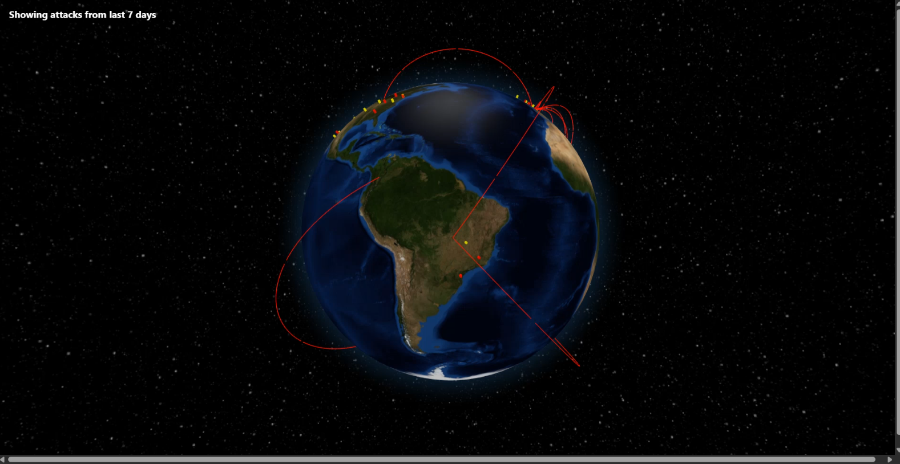
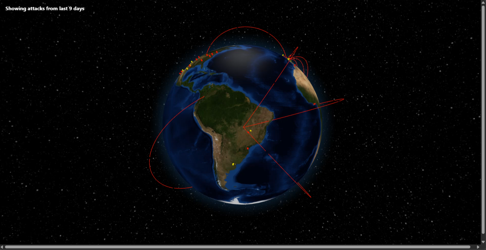

#  DDoS Map Visualization

A real-time visualization of distributed denial-of-service (DDoS) attacks on a globe, using live data from Cloudflare and AbuseIPDB. The project uses a trained machine learning model to classify IPs and show their threat level.

---

## Features

- Real-time attack visualization on a 3D globe
- Cloudflare attack data integration
- AbuseIPDB threat scoring using ML model
- IP geolocation caching for faster performance
- Color-coded attack points based on threat level

---

## Setup \& API Keys

## 1. Clone the repository

	- git clone https://github.com/Shaurya-34/ddos-map.git

	- cd ddos-map

## 2. Install frontend dependencies

	- cd frontend

	- npm install

## 3.Install backend dependencies

	-cd ..

	-pip install -r requirements.txt

## 4. Create .env file

In the project root, create a .env file with the following keys:

	- CLOUDFLARE\_RADAR\_TOKEN=<your\_cloudflare\_token>

	- ABUSEIPDB\_API\_KEY=<your\_abuseipdb\_key>

	- IPINFO\_TOKEN=<your\_ipinfo\_token>

# (IMP) How to get the API keys:

## Cloudflare Radar Token (CLOUDFLARE\_RADAR\_TOKEN)

	1. Sign up for a Cloudflare account.
	2. Go to Cloudflare Radar API and generate a personal API token.
	3. Make sure it has permission to read attack data.

## AbuseIPDB API Key (ABUSEIPDB\_API\_KEY)

	1. Register at AbuseIPDB
	2. Verify your email and log in.
	3. Go to API Key page and copy your key.

## IPInfo Token (IPINFO\_TOKEN)
	1. Sign up at IPInfo.io
	2. After login, go to the API Access page to get your token.

# These keys are PRIVATE. DO NOT SHARE them PUBLICLY. 
  	- The .env file is ignored in Git by .gitignore.

# RUNNING THE PROJECT

### 1. Start the backend: 
	- uvicorn backend.main:app --reload

### 2. Start the frontend:

	cd frontend
 	npm run dev

### 3. Open your browser at
  	 http://localhost:3000 to view the globe.
  

### 4. Check the raw IP + ML classification data (optional):
 	 http://127.0.0.1:8000/combined

## GeoLite Database

The project can optionally use the GeoLite2-Country.mmdb file for IP geolocation.

\- You can keep `data/geolite/GeoLite2-Country.mmdb` in the project for faster lookups.  
\- Make sure to respect the GeoLite2 license(data/geolite/LICENSE.txt).  
\- Alternatively, you can remove the `.mmdb` file and the project will fall back to IPInfo.io for geolocation.

## Machine Learning Model

- The model classifies IP addresses in real-time using AbuseIPDB scores and country codes.
- ip\_classifier.joblib and country\_encoder.joblib are included in ddos-map/backend/models.
- Training scripts are in ddos-map/model/ in case you want to retrain the model.

> **Note:** AbuseIPDB data does not directly indicate DDoS attacks.  
> Instead, it provides general reports of abusive IPs.  
> The ML model analyzes this data along with country codes to **predict which IPs are more likely associated with DDoS traffic**, making the visualization more relevant.  

# LICENSE

This project is licensed under the MIT License:
You are free to use, copy, modify, merge, publish, distribute, sublicense, and/or sell copies of the project
You must include the original license and copyright notice in all copies or substantial portions.
The project is provided "as is", without warranty of any kind.

# IMP NOTES

- Keep data/ip\_cache.csv to speed up geolocation lookups.
- The ML model works without the training dataset, but keeping it allows retraining if needed.
- .env contains sensitive API keys and should never be pushed to Git.

## Screenshots  

### Main Globe View  
  

### Attack Visualization Example  
  

